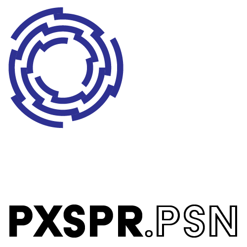

Package for Cycling 74's Max environment containing extensions for sending/receiving PosiStageNet data, for use in stage automation, tracking and general co-ordinate data transfer applications. 

See <http://www.posistage.net/> for more information on PosiStageNet.

## Download
Package download available from [releases](/releases/latest).

## License
pxspr.psn is released under the [MIT license](LICENSE), allowing use in any commercial/non-commercial application providing that the copyright notice is included.

## Dependencies
All dependencies are included as Git submodules.
- [max-sdk](https://github.com/Cycling74/max-sdk) - Max SDK for developing external objects.
- [psn-cpp](https://github.com/vyv/psn-cpp) - Official PosiStageNet C++ implementation used for parsing data.
- [asio](https://github.com/chriskohlhoff/asio) - UDP socket IO.

## Building
### Windows
Build pxspr.psn.sln using Visual Studio 2019.
### Mac
Build pxspr.psn.xcodeproj using XCode.

## Copyright
pxspr.psn copyright (c) 2021 Pixsper Ltd.
